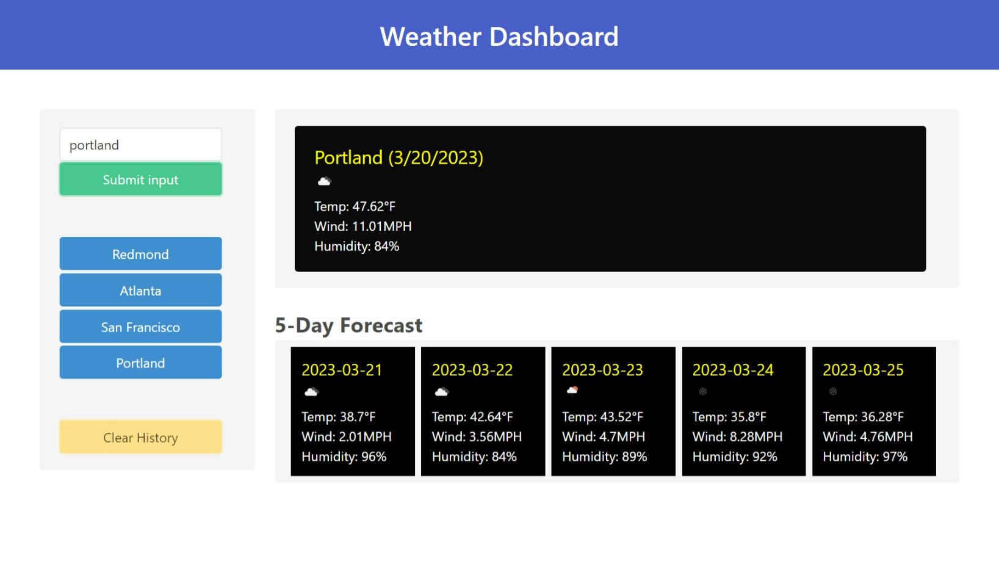

# Weather Dashboard

## Description

This is a weather dashboard application, where you can get current and 5-day forecast weather conditions of a city. 

## Usage

In the webpage when you enter a city name and click submit you can see the current weather conditions on top and 5-day 
forecast below it. The weather data includes the city name, the date, an icon representation of weather conditions, 
the temperature, the humidity, and the wind speed. The cities you have searched are added to the search hisory. If 
you click on a city in the search history then you are presented with current and future weather conditions for that city.

If you have different cities with same name you can specify the state and country codes. 
e.g: "CITYNAME, STATE CODE, COUNTRY CODE" or "CITYNAME, COUNTRY CODE".   

## Credits

Built this quiz based on the knowledge gathered from bootcamp activities.
Used BULMA CSS framework for this project. Thanks BULMA!

## License

MIT License

## Project URL

URL link to the Weather Dashboard webpage:
(https://saritha2708.github.io/weather-dashboard/).

## Project image

The following image shows the display of the webpage:

